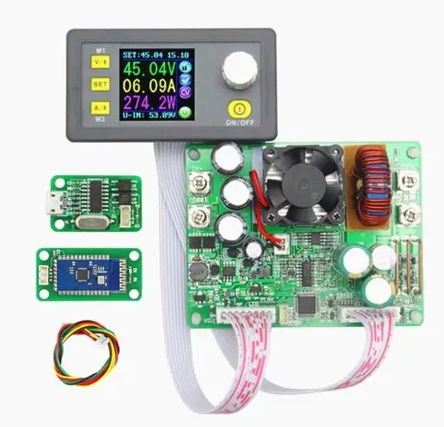
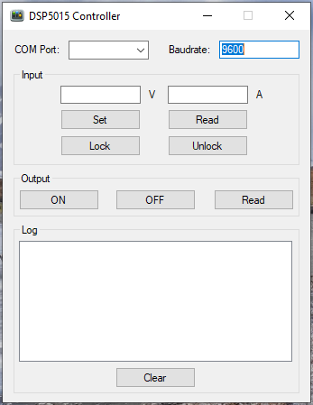

## DPS5015 Controller Desktop App

This is a desktop app (Windows) that operates as a remote controller for the power supply interface model DPS5015 by Ruideng through Serial Port (COM).

The main objective of this project was to understand how the communication between PC and the DPS5015 worked for further application in latter projects.

It was developed based on the documentation given by the manufacturer that presents the serial communication commands consisting of hexadecimal strings sent and received (TX/RX) through this communication channel.

